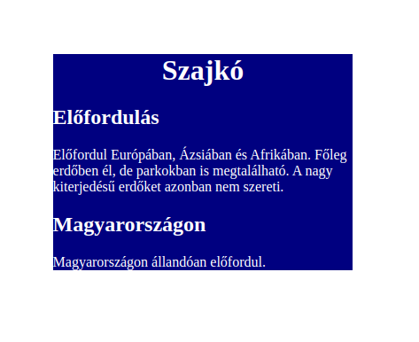

# CSS002

* Szerző: Sallai András
* Copyright © 2014, Sallai András
* Szerkesztve: 2014-2024
* Licenc: CC BY-SA 4.0
* Web: https://szit.hu

Ez a projekt tartalmazza egy egyszerű weboldal feladatát, amely a `Szajkó` című madár információit tartalmazza. Az oldal HTML és CSS fájlokat használ a megfelelő stílusok alkalmazásához.

## Feladatok:

1. A weboldalon szerepeljen a `Szajkó` madár információja.
2. A `body` elem tartalmát `div` elembe kell helyezni, amely a `container` osztályhoz tartozik.
3. A címsorban a `Szajkó` szó szerepeljen.
4. A weboldal külső CSS fájlt használ, amely:
   - A `.container` osztályban 15%-os margót, navy háttérszínt és fehér betűszínt állít be.
   - A `h1` elem szövege középre legyen igazítva.

## Tesztelés futtatása:

A teszteléshez használja a következő parancsot:

```bash
pytest


